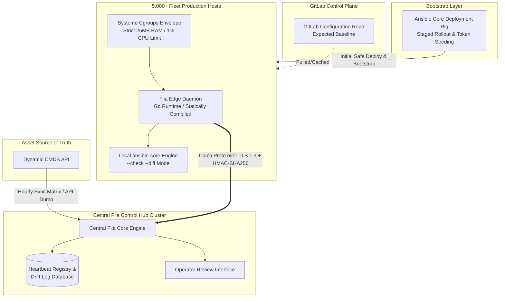
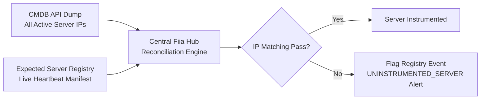

## Product Requirements Document (PRD)## Project Fiia: High-Performance Configuration Audit & Fleet State Agent
------------------------------
## 1. Executive Summary & Core Philosophy## 1.1 Objective
Project Fiia (Federation of Independent Intelligent Agents) is an open-source, ultra-lightweight, native configuration audit daemon designed for rapid deployment onto existing massive server fleets (5,000+ bare-metal/hypervisor nodes). It operates passively on a periodic tight loop to detect system drift against a GitLab baseline using local, read-only ansible-core binaries while simultaneously acting as a lightweight, zero-allocation fleet health and liveness telemetry reporter.
## 1.2 Core Constraints & "Zero-Impact" Mandate
Because Fiia is deployed onto a production fleet with active multi-tenant workloads, it operates under a strict non-interference mandate. Host stability is its absolute metric.

* Zero Autonomy: Automated self-healing loops (e.g., Kubernetes-style crash loops or automated remediations) are strictly prohibited.
* Air-Gapped Discovery: The system isolates the discovery process from operational risk. It can only alert and report; mutation rights are stripped completely from the edge daemon.
* Deterministic Bounds: All resource usage (CPU, Memory, and Disk I/O) is capped globally via the operating system kernel to ensure customer tenant processes are never starved of execution or hardware cycles.

------------------------------
## 2. End-to-End System Architecture
The architecture relies on a pull-based decentralized telemetry loop. The edge agent executes calculations locally, bypassing the need for a central orchestrator to maintain thousands of open SSH tunnels.



------------------------------
## 3. Frugal Resource Guardrails & Performance Metrics
To safeguard active multi-tenant servers, Fiia caps resource consumption using Linux cgroups handled directly through its systemd runtime wrapper profile.

| Resource Dimension | Strict Target Limit | Enforcement Mechanism | Technical Strategy |
|---|---|---|---|
| CPU Allocation | Max 1.0% of a single core | CPUQuota=1% in systemd unit | Hard throttle via OS kernel scheduler; drops processing priority below all user workloads. |
| Memory Footprint | Max 25MB RAM (RSS) | MemoryMax=25M in systemd unit | Native Go static compilation; strict buffer pooling; zero-allocation binary wire serialization. |
| Disk I/O Bandwidth | Max 500 KB/s throughput | IOReadBandwidthMax, IOWriteBandwidthMax | Throttles log parsing and baseline file evaluations to prevent storage channel starvation. |
| Process Niceness | Lower priority scheduling | Nice=19 and IOSchedulingClass=idle | Yields all thread execution windows immediately whenever customer workloads request hardware time. |

------------------------------
## 4. Edge Daemon Operational Mechanics## 4.1 Automated Execution Loop & Subprocess Isolation
Fiia operates on a tight local timer, entirely decoupled from network latency bottlenecks during evaluation steps:

   1. The Cycle: Every 15–30 minutes, the native daemon awakens, parses locally cached configuration assets, and forks a low-priority, sandboxed subprocess: /usr/bin/ansible-playbook --check --diff.
   2. Subprocess Isolation: The execution is wrapped via a restricted runtime or minimal user namespace. If the underlying local Ansible execution fails, encounters an infinite loop, or hangs, Fiia kills the child process cleanly without destabilizing the node.
   3. Panic-Free Runtime: The daemon binary avoids dynamic heap thrashing and memory fragmentation by reusing statically allocated memory blocks.

## 4.2 Liveness Verification & Pause Detection
Because the agent acts passively, an accidental or malicious execution pause must be surfaced immediately upstream without allowing the agent to mutate its own system states.

* Passive Watchdog: Fiia implements the systemd watchdog protocol (Type=notify). If the internal tight processing loop lock-free state fails, freezes, or experiences a deadlock, systemd logs a fatal runtime error.
* Central Heartbeat: Every 5 minutes, decoupled from the heavy configuration audit task, a micro-routine dispatches an empty, optimized Cap'n Proto ping packet over a standard TLS channel to the central hub.
* Missing State Alerting: If the central cluster misses two consecutive heartbeats from an asset ID, the node is flagged immediately as AGENT_PAUSED or AGENT_UNREACHABLE on the dashboard, prompting a human operator to verify machine health.

------------------------------
## 5. Fleet Control & Discovery (CMDB Integration)## 5.1 Dynamic Discovery & Instrumentation Auditing
Discovering uninstrumented nodes (shadow infrastructure) across 5,000+ nodes is handled through an out-of-band central reconciliation pipeline.



* The Sync Matrix: The Central Fiia Core Hub queries the dynamic CMDB API once per hour to pull an absolute, live manifest of all active bare-metal IPs and hypervisor hostnames.
* Cross-Reference Pass: The Hub cross-references this infrastructure asset map against the active live mTLS Heartbeat Registry database.
* The Shadow Flag: Any server present in the CMDB that has failed to establish a heartbeat payload within the trailing 60 minutes is marked as UNINSTRUMENTED_SERVER on the master operator interface for engineering intervention.

## 5.2 Initial Deployment Protocol via Ansible Tagging
Deploying onto an active server farm carrying tenant production layers represents a primary risk vector. Fiia mitigates this via a staged, non-disruptive rollout protocol:

   1. Host Profiling: The CMDB inventory is grouped to cleanly partition the fleet based on customer workload tags (e.g., workload: latency-critical, workload: database).
   2. Safe Staged Rollout: The deployment playbook distributes the statically compiled Fiia binary utilizing strict concurrency limits (serial: 5%), progressive cascading across the infrastructure over several calendar windows.
   3. Automated Resource Provisioning: The execution engine builds the systemd unit parameters dynamically on the fly, locking down the resource limits specified in Section 3 prior to initializing the daemon thread.
   4. Validation Run: The installation playbook executes an initial dry-run handshake to confirm the network identity safely registers inside the central monitoring registry before releasing the deployment lock.

------------------------------
## 6. Central Telemetry & Brendan Gregg's USE Method Integration
To minimize overhead, Fiia avoids execution forks of common system command utilities (top, free, df, ps). Instead, the daemon parses raw Linux kernel virtual filesystems (/proc and /sys) to map Brendan Gregg’s USE Method (Utilization, Saturation, and Errors) into a unified, zero-allocation data payload.

```mermaid
graph TD
    subgraph Host_Kernel_VFS [/proc & /sys Virtual Filesystems]
        proc_stat[/proc/stat<br>CPU Usage]
        proc_mem[/proc/meminfo<br>RAM Allocations]
        proc_disk[/proc/diskstats<br>Storage Counters]
        proc_net[/proc/net/dev<br>Network Errors & Bytes]
        proc_psi[/proc/pressure/*<br>Pressure Stall Information]
    end

    subgraph Fiia_Collector [Fiia Metric Harvester Engine]
        Harvest[Go Micro-Parser<br>Zero-Allocation Loops]
    end

    subgraph CapnProto [Serialization Layer]
        Pack[Cap'n Proto Struct Builder<br>Zero-Copy Native Memory Array]
    end

    proc_stat --> Harvest
    proc_mem --> Harvest
    proc_disk --> Harvest
    proc_net --> Harvest
    proc_psi --> Harvest
    
    Harvest --> Pack

```

## 6.1 Data Ingestion Matrix

* CPU Profile:
* Utilization: Calculated by evaluating the delta between active worker thread timing registers and total system idle frames within /proc/stat.
   * Saturation: Mapped using CPU Pressure Stall Information (PSI) via /proc/pressure/cpu. This tracks the exact execution time percentages that workloads spent stalled waiting for available CPU cores.
* Memory Profile:
* Utilization: Parsed from /proc/meminfo tracking the spread between MemTotal and MemAvailable.
   * Saturation: Read via /proc/vmstat and memory PSI counters to parse active kernel page-scanning frequencies and swap-in/swap-out event occurrences.
* Storage (Disk I/O) Profile:
* Utilization: Collected via active execution time metrics recorded across block storage device paths inside /proc/diskstats.
   * Saturation: Extracted from /proc/pressure/io to track hardware I/O bottlenecks and disk-wait stall values.
* Network Profile:
* Utilization: Computed using total frame, packet, and throughput delta tracks inside /proc/net/dev.
   * Errors: Parsed directly from the native interface drop and receive/transmit error registers (rx_errors, tx_errors) inside /proc/net/dev.

------------------------------
## 7. Transport Security & Anti-Spoofing Protocol
To avoid the maintenance overhead, rotation failures, and configuration complexities of managing 5,000+ client certificates (mTLS), Fiia implements a asymmetric control model: One-Way TLS (Server-Only Certificate) + Symmetric Message HMAC signing.

sequenceDiagram
    autonumber
    participant Agent as Fiia Edge Agent Node
    participant Hub as Central Infrastructure Hub
    
    Note over Agent: Validates Central Hub TLS Certificate<br>via Embedded Root CA String (Secure Pipe)
    Agent->>Hub: TCP / TLS 1.3 Session Connection Established
    
    Note over Agent: Assembles Cap'n Proto Payload Byte Stream<br>Computes HMAC-SHA256(Host Secret, Payload Bytes)
    Agent->>Hub: Sends [Payload Bytes] + [Trailing 32-Byte Signature Envelope]
    
    Note over Hub: Extracts Node ID from Packed Bytes<br>Fetches Local Host Secret from Token DB
    Note over Hub: Computes Expected Signature Validation Pass
    alt Signatures Match Exactly
        Hub->>Hub: Accept Payload & Store Metrics/Drift Logs
    else Signature Mismatch / Tampered / Spoofed
        Hub->>Hub: Instantly Drop Packet & Trigger Security Anomaly Alert
    end

## 7.1 Security Architecture Specifications

* The Secure Pipe (One-Way TLS): Central servers maintain a standard TLS 1.3 certificate signed by an internal corporate CA. Edge daemons embed this root certificate to verify server authenticity, neutralizing Man-in-the-Middle (MITM) exposures without requiring any local node client certificate assets.
* The Wire Signature (Symmetric HMAC): During bootstrap, the deployment rig generates a unique, cryptographically random host secret (SHA-256 token) for each server, mapping it into /etc/fiia/agent.toml with root-only read parameters (0400).
* Validation Flow: Before data transmission, the daemon passes the raw Cap'n Proto byte array through an HMAC-SHA256 engine keyed with this local secret token. The resultant 32-byte signature is appended directly to the end of the wire frame. The central server validates this frame instantly using a high-speed database key-value lookup of that machine's secret key, discarding altered or unauthenticated transmissions with near-zero CPU footprint.

------------------------------
## 8. Scalability Vectors & Network Capacity Modeling## 8.1 Baseline Sizing (Normal Operation Profile)
Under steady state parameters, 99% of nodes report clean match logs without configuration drift. Traffic reflects simple heartbeat payloads:

* Wire Frame Footprint: A standard telemetry array housing NodeID, Timestamp, Metrics, and Status flags maps to a packed block of ~96 bytes.
* Fleet Volume Capacity: 5,000 nodes connecting once every 300 seconds yields an average arrival velocity of 16.6 data requests per second:
$$\text{Throughput} = 16.6 \text{ req/sec} \times 96 \text{ bytes} \approx 1.6 \text{ KB/sec}$$ 

## 8.2 Peak Sizing (Mass Drift Out-of-Band Instability)
If a global configuration variable error or file mutation propagates across the infrastructure, all 5,000 servers will generate unified text diff arrays concurrently.

* Massive Load Sizing: Assuming an extreme scenario where a 50KB configuration text diff block is captured across every host in the pool, the individual packed packet volume scales to ~51KB per host.
* Congestion Mitigation Controls:
1. Randomized Splay Jitter: The daemon's internal activation loop applies a randomized execution offset variable (splay) of up to 120 seconds. This flattens the immediate 255MB global data wave into a smooth ingress trajectory of ~2.1MB/sec.
   2. Native TCP Backpressure: If central database or processing queues log full state registers, the ingestion layer stops reading network sockets. The edge hosts naturally buffer data transmission blocks inside local kernel TCP buffers without increasing active daemon memory allocations or breaking the 25MB RAM boundary.

------------------------------
## 9. Risk & Impact Mitigation Matrix

| Identified Risk Vector | Technical Impact Probability | Architectural Mitigation Strategy (Fiia Safeguards) |
|---|---|---|
| Ansible Subprocess Hangs | High (If a script block hits a broken socket lock or unresolvable network path) | The Go runtime manages child threads using a strict context.WithTimeout block set to a 10-minute maximum ceiling. If breached, a native kernel SIGKILL clears the child tree completely. |
| Host Configuration File Token Access | Low (Requires complete local root/sudo privileges to execute an infrastructure breach) | Complete Blast-Radius Isolation: Each node uses an independent token key value. Compromising a single node provides zero compromise capability over neighboring hypervisors. |
| Cgroup Limit Breach Trigger | Medium (If an excessively large configuration file diff payload forces extreme string processing) | If the child process breaks the MemoryMax=25M limit, the OS kernel OOM killer safely drops the execution fork. The parent Fiia daemon catches the execution crash signal, generates an AUDIT_RESOURCE_EXCEEDED warning flag upstream, and drops back to sleep safely. |
| Central Infrastructure Hub Outage | Low (Mitigated via clustered high-availability hub nodes) | If the network endpoint target drops dead entirely, the edge agents queue exactly one latest audit record in local static runtime memory arrays. Historical queue logging behaves state-free; no infinite memory accumulation can occur. |

------------------------------
## 10. Appendix: Go Implementation Runtime Settings
To maintain compliance with the 25MB RAM and 1.0% CPU limits, the compiled Go implementation layer must force explicit runtime parameters to block default execution heuristics:

* GOMEMLIMIT=18MiB – Informs the Go memory subsystem to execute garbage collection cycles aggressively before nearing the systemd kernel boundary.
* GOGC=10 – Decreases default memory garbage collection thresholds from 100% heap growth down to 10%, aggressively freeing text evaluation blocks.
* sync.Pool Enforcement – Reuses pre-allocated slice buffers for local command captures instead of making dynamic allocations during runtime loops.

------------------------------
## 11. Appendix: Future Inotify Performance Extensions
To optimize host resource envelopes in Phase II, Fiia will shift from strict periodic loop times to a lazy reactive kernel trigger strategy:

   1. Target Map Compiling: When the local configuration profiles are generated from GitLab, Fiia tracks file targets to map an internal watchlist (e.g., /etc/ssh/sshd_config).
   2. Inotify Kernel Watchers: The daemon attaches native Linux IN_MODIFY watch handles directly to those coordinates and drops into an idle sleep state.
   3. Local Cached Validation: Upon modification, Fiia intercepts the path change and checks the resource against a local static cache holding a cryptographically validated SHA-256 baseline block map (/var/cache/fiia/expected_manifest.json).
   4. Conditional Execution Gate: If the file checksum matches the expected configuration cache value, the modification alert is dropped. If it registers an out-of-band mismatch, the agent skips the standard wait cycle and wakes up the subprocess engine to extract the unified configuration drift details for human triage.

